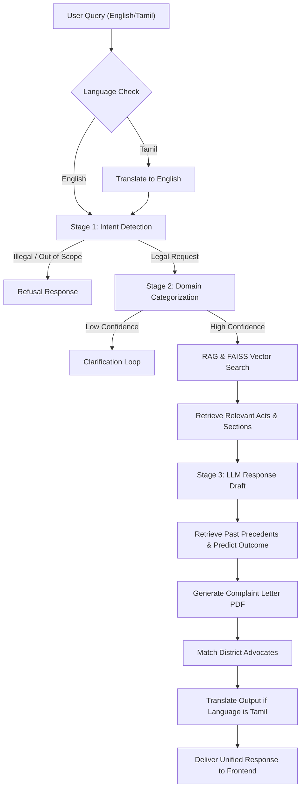

# LawShathi: Legal AI System

An AI-powered legal assistance platform designed to make legal services more accessible, structured, and understandable for citizens in India. By utilizing a multi-stage NLP classification pipeline, Retrieval-Augmented Generation (RAG), and a historical judgment analysis engine, LawShathi provides legal advice, case outcome predictions, localized advocate matching, and automated complaint letter generation in both English and Tamil.

---

## 🌟 Key Features

1. **Multi-Stage AI Pipeline**:
   - **Stage 1 (Intent Detection)**: Classifies queries into `LEGAL_REQUEST`, `ILLEGAL_REQUEST`, or `OUT_OF_SCOPE` using fine-tuned Hugging Face Transformers.
   - **Stage 2 (Legal Domain Categorization)**: Categorizes legal issues into specific domains (e.g., Criminal, Civil, Consumer, Family, Property Law) with built-in confidence checks.
   - **Stage 3 (Structured Legal Consultation)**: Employs Llama 3.3 (70B) via OpenRouter to draft structured legal consultations outlining situation breakdowns, rights, risks, and next steps.
2. **Retrieval-Augmented Generation (RAG)**:
   - Integrates a semantic search vector index built via Sentence Transformers (`all-MiniLM-L6-v2`) and FAISS to retrieve relevant Indian acts and sections.
3. **Case Outcome & Precedent Predictor**:
   - Analyzes historical court judgments to predict case outcomes.
   - Performs TF-IDF cosine-similarity queries to match precedents.
4. **Bilingual Experience**:
   - Fully supports English and Tamil language queries.
   - Dynamically translates texts via a Google Translator wrapper (`deep-translator`).
5. **Smart Document Generator**:
   - Automatically generates localized complaint letters or legal notices (PDF format) using ReportLab.
6. **Advocate Matchmaker**:
   - Matches users with registered advocates in Tamil Nadu based on their registered district and domain match scores.
7. **Accessibility Tools**:
   - Integrated Speech-to-Text (STT) and Text-to-Speech (TTS) functionalities.

---

## 🏗️ Architecture Flow

The workflow below describes the query lifecycle inside the system:



---

## 📂 Project Structure

```
LawShathi/
├── Abstract.pdf                            # Executive project abstract
├── Flow Diagram.png                        # Workflow diagram
├── RAG Architecture.jpeg                   # Vector retrieval details
├── SystemPrompt.txt                        # Base LLM prompt structures
├── report.py                               # Standalone petition generator script
├── frontend/                               # React Single Page Application (SPA)
│   ├── public/                             # Static assets
│   ├── src/
│   │   ├── assets/                         # SVG icons and visual items
│   │   ├── hooks/                          # Custom React Hooks (e.g., speech recognition)
│   │   ├── layout/                         # Core page layout grid styling
│   │   ├── pages/                          # React views (Agent, Chat, Judgments, Auth, etc.)
│   │   ├── services/                       # API integration setups
│   │   ├── App.jsx                         # React routing mapping
│   │   └── main.jsx                        # Client boot entry
│   └── package.json                        # Node dependencies & run scripts
│
├── Legal_AI_System/                        # Python API and Pipeline Backend
│   ├── Data/                               # Model training datasets
│   ├── Evaluation/                         # Pipelines validation scripts
│   ├── Notebooks/                          # Model training ipynb scripts
│   ├── Pipeline/                           # Unified orchestration engine
│   │   ├── app.py                          # Main Flask server entry
│   │   ├── main_pipeline.py                # Pipeline execution logic
│   │   ├── agent_controller.py             # Orchestrator for unified agent responses
│   │   └── ai_complaint_generator.py       # ReportLab PDF building rules
│   ├── RAG/                                # Knowledge base & FAISS vectorization
│   │   ├── build_index.py                  # SentenceTransformer FAISS indexer
│   │   └── Rag_Service.py                  # FAISS retrieval lookup
│   └── Services/                           # Backend services
│       ├── Stage1_service.py               # Intent classifier loader
│       ├── Stage2_service.py               # Domain classifier loader
│       ├── Stage3_service.py               # LLM prompt and integration engine
│       ├── translation_service.py          # deep-translator service
│       ├── user_service.py                 # local file-based database for credentials
│       ├── judgment_service.py             # Precedents service wrapper
│       └── advocate_service.py             # City/Specialization match logic
│
└── judge/                                  # Precedents prediction model
    ├── case_index.csv                      # Index of registered cases
    ├── judgments_final.csv                 # Detailed precedents texts database
    ├── legal_analyzer.py                   # Precedent search & outcomes engine
    ├── outcome_predictor.pkl               # ML outcome classifier
    └── retrieval_vectorizer.pkl            # TF-IDF feature extraction vectorizer
```

### 🔗 Key Source Files
- **Flask Server**: [app.py](file:///d:/Legal%20AI%20System/LawShathi-main/Legal_AI_System/Pipeline/app.py)
- **Pipeline Orchestrator**: [main_pipeline.py](file:///d:/Legal%20AI%20System/LawShathi-main/Legal_AI_System/Pipeline/main_pipeline.py)
- **Agent Orchestrator**: [agent_controller.py](file:///d:/Legal%20AI%20System/LawShathi-main/Legal_AI_System/Pipeline/agent_controller.py)
- **Complaint/Notice PDF Engine**: [ai_complaint_generator.py](file:///d:/Legal%20AI%20System/LawShathi-main/Legal_AI_System/Pipeline/ai_complaint_generator.py)
- **Precedent Analysis Subsystem**: [legal_analyzer.py](file:///d:/Legal%20AI%20System/LawShathi-main/judge/legal_analyzer.py)
- **FAISS Retriever**: [Rag_Service.py](file:///d:/Legal%20AI%20System/LawShathi-main/Legal_AI_System/RAG/Rag_Service.py)
- **Frontend Routing Router**: [App.jsx](file:///d:/Legal%20AI%20System/LawShathi-main/frontend/src/App.jsx)
- **Frontend Agent UI View**: [Agent.jsx](file:///d:/Legal%20AI%20System/LawShathi-main/frontend/src/pages/Agent.jsx)

---

## 🛠️ Installation & Setup

### Prerequisites
- Python 3.10+
- Node.js v18+
- OpenRouter API Key (Llama 3.3 Inference)

### 1. Set Up Backend API Server

Create and activate a virtual environment, then install the required Python packages.

```bash
# Navigate to Backend base
cd "Legal_AI_System/Pipeline"

# Create a virtual environment
python -m venv venv
source venv/bin/activate  # On Windows, use: venv\Scripts\activate

# Install required packages
pip install flask flask-cors openai reportlab transformers sentence-transformers faiss-cpu numpy scipy pandas scikit-learn joblib deep-translator torch
```

#### Set environment variable:
You need an OpenRouter API key configured to access Llama 3.3.
- **Windows (PowerShell)**:
  ```powershell
  $env:OPENROUTER_API_KEY="your_openrouter_api_key_here"
  ```
- **Linux/macOS**:
  ```bash
  export OPENROUTER_API_KEY="your_openrouter_api_key_here"
  ```

#### Train / Prepare Models & Index:
Before launching the server, ensure that the classifier models and vector databases are available.
1. Run [build_index.py](file:///d:/Legal%20AI%20System/LawShathi-main/Legal_AI_System/RAG/build_index.py) to compile the legal knowledge base into the FAISS index file.
2. Put or train Stage1 and Stage2 Models inside `Legal_AI_System/Models/` using notebooks in `Legal_AI_System/Notebooks/`.
3. Put the output predictors and vectorizers in the `judge/` folder (`outcome_predictor.pkl`, `retrieval_vectorizer.pkl`).

#### Start Backend Flask App:
```bash
python app.py
```
The server will boot on `http://localhost:5000`.

### 2. Set Up Frontend Web Client

```bash
# Navigate to frontend folder
cd "../../frontend"

# Install dependencies
npm install

# Start local Vite development server
npm run dev
```
The client dashboard will run at `http://localhost:5173`.

---

## 🖥️ Usage

- **User Authentication**: Register an account with your Name, Address, District, and contact information. Your district details are dynamically used to match advocates and compile formal complaint headers.
- **AI Agent (Unified View)**: Paste your issue description into the primary prompt block. The agent executes a three-column pipeline:
  - **Left Column**: Displays similar historical court judgments retrieved via cosine similarity on tfidf matrices.
  - **Center Column**: Explains your rights, strategic directions, strengths, and relevant sections of Indian Law using RAG context.
  - **Right Column**: Compiles an official legal complaint document based on your profile inputs and offers a PDF download link.
- **Precedent Lookup**: Use the Judgment module to search case citations and view details including the background facts, argument analyses, and final court outcomes.
- **Language Switch**: Toggle between English and Tamil at the top header to automatically view chatbot feedback, documents, and instructions in your preferred language.

---

## ⚖️ Disclaimer

*LawShathi is an AI research and decision-support system designed to provide preliminary insights into legal provisions and options. It does not constitute professional legal advice. Users should consult a qualified advocate for official litigation matters.*
